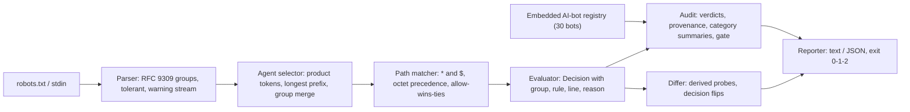

# crawlaw

[English](README.md) | [中文](README.zh.md) | [日本語](README.ja.md)

[](LICENSE)   [](CONTRIBUTING.md)

**RFC 9309 に厳密準拠したセマンティクスを持つ、オープンソースかつ依存ゼロの robots.txt 評価器：どのボットが何を取得できるかを証明し、1 コマンドで既知の AI クローラー 30 種をポリシーに照らして監査し、2 つのポリシーをテキストではなく挙動で比較する——完全オフライン。**


```bash
# not yet on npm — install from a checkout of this repository
npm install && npm run build && npm pack
npm install -g ./crawlaw-0.1.0.tgz
```

## なぜ crawlaw？

AI クローラーのブロックは 2026 年のパブリッシャー界隈で最も熱い争いだが、その戦場は、ほとんど誰も正しく評価できないファイル形式の中にある。GPTBot があなたのアーカイブを読めるかを決めるルールは微妙だ：グループ選択はプロダクトトークンに対する最長プレフィックス一致で、`Googlebot-News` は `googlebot` グループに黙って従い、同一トークンの複数グループは統合必須、優先順位はオクテット数の最長一致で同点なら allow が勝ち、`$` はアンカー、`%2F` は `/` ではなく、空の `Disallow:` は見た目と逆の意味を持つ。多くの「robots チェッカー」はホスト型のウェブフォームで、一度に 1 つの URL しか評価できない；パーサーライブラリは許可/不許可は答えても*なぜ*かは答えず、どの user agent が AI トレーナーでどれが検索エンジンかを知らず、ファイルを編集して何が変わったかも教えてくれない。crawlaw は証拠を内蔵した仕様厳密な評価エンジンだ：すべての判定が一致したグループ、勝ったルール、その行番号を引用し、AI 時代のクローラー 30 種の内蔵レジストリ（出典付きのコンプライアンス注記あり）が 1 コマンドを完全な監査に変え、セマンティック差分器が導出したプローブパス上でポリシーの両バージョンを評価してレビューに反転したすべての決定を見せる——すべてオフライン、決定的、CI 向けの終了コード付き。

|  | crawlaw | robots-parser (npm) | Google robotstxt (C++) | ホスト型 robots テスター |
|---|---|---|---|---|
| 証拠付き判定（グループ、ルール、行番号） | あり——全決定 | 真偽値 + 行インデックス | 真偽値 | 部分的、URL 単位 |
| AI クローラー監査（内蔵 30 ボットレジストリ） | あり、1 コマンド | なし | なし | なし |
| コンプライアンスへの誠実さ（robots.txt を無視するボット） | ボットごとに明示 | なし | なし | なし |
| セマンティックなポリシー差分（テキストでなく決定） | あり、導出プローブ付き | なし | なし | なし |
| 実行場所 | あなたのターミナルと CI、完全オフライン | JS ライブラリ | C++ ライブラリ + CLI | 他人のサーバー |
| CI 終了コード / ゲート | 0/1/2 + `--require-blocked` | ライブラリ戻り値 | 二値の終了コード | なし |
| ランタイム依存 | 0 | 0 | abseil + CMake ツールチェーン | 該当なし（ホスト型） |

<sub>機能の記載は各プロジェクトの公開ドキュメントに基づき確認、2026-07。</sub>

## 特長

- **RFC 9309 厳密評価** — 最長プレフィックスのグループ選択と RFC 必須のグループ統合、`*`/`$` パターンを正規表現なしの線形マッチングで処理、オクテット計測の最長一致優先、同点は allow 勝ち、パーセントエンコーディング正規化（`%7E` ≡ `~`、`%2F` ≢ `/`）、デフォルト許可。
- **弁護できる判定** — `check` はパスごとに一致グループ、勝ちルール、両方の行番号を印字；`--format json` は同じ証拠を機械向けに運ぶ。
- **内蔵の 30 ボット AI クローラーレジストリ** — GPTBot から Bytespider まで、カテゴリ別（訓練 / AI 検索 / オンデマンド取得 / 検索 / アーカイブ）に整理し、運営者、目的、出典付きの `respectsRobots` フィールドを持つ；`audit` が 1 コマンドで全部を、オフラインで実行。
- **張り子の盾に正直** — robots.txt を無視すると文書化されたボットへの「blocked」判定は祝われず注記される：ルールはお願いであって、鍵ではない。
- **セマンティックなポリシー差分** — `diff` は両側の全ルールパターンからプローブパスを導出し、反転した agent/パス決定を前後の理由付きで報告、構造変化も併記；変化があれば diff(1) と同じく終了コード 1。
- **CI のために、依存ゼロ** — 決定的な出力、デプロイゲートとしての `--require-blocked ai-training`、`-` で stdin、終了コード 0/1/2；必要なのは Node.js だけで、ツールはソケットを一切開かない。

## クイックスタート

インストール：

```bash
# not yet on npm — install from a checkout of this repository
npm install && npm run build && npm pack
npm install -g ./crawlaw-0.1.0.tgz
```

あるボットが URL を取得できるか尋ねる（`examples/publisher.txt` はリポジトリに同梱）：

```bash
crawlaw check examples/publisher.txt --agent GPTBot /articles/2026/scoop
```

出力（実際の実行記録）：

```text
BLOCKED  GPTBot  /articles/2026/scoop
          group "gptbot" (line 4), rule "disallow: /" (line 11) is the longest match
```

終了コード 1——ブロック、行番号という証拠付き。次にポリシー全体を既知の全 AI クローラーに照らして監査する（実際の実行記録、最初のカテゴリを抜粋）：

```bash
crawlaw audit examples/publisher.txt
```

```text
crawlaw audit — examples/publisher.txt — 30 known bots, path /

AI training — 7 of 15 blocked
  bot                           operator               verdict                          how
  GPTBot                        OpenAI                 blocked                          explicit "gptbot" group (line 4)
  ClaudeBot                     Anthropic              blocked                          explicit "claudebot" group (line 4)
  CCBot                         Common Crawl           blocked                          explicit "ccbot" group (line 4)
  Google-Extended               Google                 blocked                          explicit "google-extended" group (line 4)
  Applebot-Extended             Apple                  blocked                          explicit "applebot-extended" group (line 4)
  Bytespider                    ByteDance              blocked (!) compliance disputed  explicit "bytespider" group (line 4)
  Meta-ExternalAgent            Meta                   blocked                          explicit "meta-externalagent" group (line 4)
  FacebookBot                   Meta                   allowed                          "*" group (line 16)
  ...

note: a robots.txt rule is a request, not a lock —
  Bytespider: Feeds ByteDance LLMs; repeatedly reported crawling despite disallow rules.
  PerplexityBot: Builds the Perplexity answer index; third parties have reported undeclared fetching.
```

このポリシーは AI トレーナー 7 種を*名指し*しているが、さらに 8 種がまだ自由にクロールしている——まさにこの穴を `--require-blocked ai-training` がビルド失敗に変える。ポリシー編集をテキストではなく挙動でレビューするには（実際の実行記録、抜粋）：

```bash
crawlaw diff examples/before.txt examples/after.txt
```

```text
crawlaw diff — examples/before.txt → examples/after.txt (6 probe paths)

6 decisions changed:
  * (any other bot)  /internal/   blocked → allowed
  * (any other bot)  /internal/x  blocked → allowed
  ccbot              /            allowed → blocked
  ccbot              /x           allowed → blocked
  gptbot             /            allowed → blocked
  gptbot             /x           allowed → blocked

  * /internal/
    before: group "*": disallow: /internal/ (line 4)
    after:  group "*": no rule covers the path (default allow)
  ...
```

この編集は意図どおり GPTBot をブロックした——そして誤って `/internal/` を他の全ボットに開放した。さらなるシナリオ（完全なパブリッシャー監査、CI ゲートスクリプト）は [examples/](examples/README.md) にある。

## コマンド

| コマンド | 動作 | 終了コード |
|---|---|---|
| `check <robots> --agent <bot> <path>...` | 1 つのボットをパス/URL に対して評価、証拠付き | 0 許可、1 ブロック、2 用法エラー |
| `audit <robots> [--path <p>]... [--require-blocked <cat>]` | 内蔵レジストリを実行、カテゴリ集計、CI ゲート | 0 正常、1 ゲート失敗、2 用法エラー |
| `diff <old> <new> [--agent <bot>]... [--path <p>]...` | 導出プローブパス上のセマンティック差分 | 0 同一、1 変化あり、2 用法エラー |
| `agents [--category <cat>]` | 内蔵レジストリを印字 | 0、2 用法エラー |

すべてのサブコマンドは `--format text|json`（JSON の形は安定 API）、stderr のパーサー警告を消す `--quiet`、そして `-` による stdin からの robots.txt 読み込みを受け付ける。`--agent` は素のトークン（`GPTBot`）、`Token/1.2` 形式、完全な User-Agent ヘッダーのいずれも可。レジストリのカテゴリ：`ai-training`、`ai-search`、`ai-assistant`、`search`、`archive`——収録基準は [docs/registry.md](docs/registry.md)、厳密な一致セマンティクスは [docs/evaluation.md](docs/evaluation.md) を参照。

## アーキテクチャ



## ロードマップ

- [x] RFC 9309 パーサー + 評価器、30 ボット AI レジストリ、`check`/`audit`/`diff`/`agents`、`--require-blocked` ゲート、JSON 出力（v0.1.0）
- [ ] `crawlaw fix`：修正済みポリシーの出力（漏れた AI トレーナーの名指し、失われたルールの復元）
- [ ] Sitemap クロスチェック：同じポリシーが禁止している sitemap URL を指摘
- [ ] レジストリ同期ツール：運営者ドキュメントから引用付きで `src/registry.ts` 更新を生成
- [ ] 複数ファイル監査：運営する全サイトの robots.txt を 1 つのレポートに

全リストは [open issues](https://github.com/JaydenCJ/crawlaw/issues) を参照。

## コントリビュート

コントリビュート歓迎。`npm install && npm run build` でビルドし、`npm test`（90 テスト）と `bash scripts/smoke.sh`（`SMOKE OK` を印字すること）を実行——このリポジトリは CI を同梱せず、上記の主張はすべてローカル実行で検証されている。[CONTRIBUTING.md](CONTRIBUTING.md) を参照し、[good first issue](https://github.com/JaydenCJ/crawlaw/issues?q=is%3Aissue+is%3Aopen+label%3A%22good+first+issue%22) を選ぶか、[discussion](https://github.com/JaydenCJ/crawlaw/discussions) を始めてほしい。

## ライセンス

[MIT](LICENSE)
