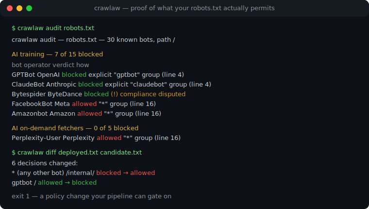
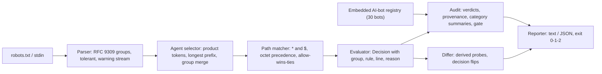

# crawlaw

[English](README.md) | [中文](README.zh.md) | [日本語](README.ja.md)

[](LICENSE)   [](CONTRIBUTING.md)

**An open-source, zero-dependency robots.txt evaluator with RFC 9309-exact semantics: prove which bots may fetch what, audit 30 known AI crawlers against your policy in one command, and diff two policies by behavior instead of by text — fully offline.**



```bash
# not yet on npm — install from a checkout of this repository
npm install && npm run build && npm pack
npm install -g ./crawlaw-0.1.0.tgz
```

## Why crawlaw?

AI-crawler blocking is the hottest publisher fight of 2026, and it is being waged inside a file format almost nobody evaluates correctly. The rules that decide whether GPTBot may read your archive are subtle: group selection is longest-prefix over product tokens, `Googlebot-News` silently obeys a `googlebot` group, multiple groups for one token must be merged, precedence is longest-match in octets with allow winning ties, `$` anchors, `%2F` is not `/`, and an empty `Disallow:` means the opposite of what it looks like. Most "robots checkers" are hosted web forms that grade one URL at a time; parser libraries answer allowed/disallowed but not *why*, know nothing about which user agents are AI trainers versus search engines, and cannot tell you what changed when you edit the file. crawlaw is a spec-exact evaluation engine with the receipts built in: every verdict cites the matched group, the winning rule and its line number; an embedded registry of 30 AI-era crawlers (with documented compliance caveats) turns one command into a full audit; and a semantic differ evaluates both versions of your policy over derived probe paths so a review shows every decision that flipped — all offline, deterministic, and exit-coded for CI.

|  | crawlaw | robots-parser (npm) | Google robotstxt (C++) | hosted robots testers |
|---|---|---|---|---|
| Verdict with proof (group, rule, line number) | yes — every decision | boolean + line index | boolean | partial, per URL |
| AI-crawler audit (embedded 30-bot registry) | yes, one command | no | no | no |
| Compliance honesty (bots that ignore robots.txt) | flagged per bot | no | no | no |
| Semantic policy diff (decisions, not text) | yes, with derived probes | no | no | no |
| Where it runs | your terminal and CI, fully offline | JS library | C++ library + CLI | someone else's server |
| CI exit codes / gates | 0/1/2 + `--require-blocked` | library return values | binary exit codes | no |
| Runtime dependencies | 0 | 0 | abseil + CMake toolchain | n/a (hosted) |

<sub>Capability notes checked against each project's public documentation, 2026-07.</sub>

## Features

- **RFC 9309-exact evaluation** — longest-prefix group selection with RFC-mandated group merging, `*`/`$` patterns via linear regex-free matching, octet-measured longest-match precedence, allow-wins-ties, percent-encoding canonicalization (`%7E` ≡ `~`, `%2F` ≢ `/`), default-allow.
- **Verdicts you can defend** — `check` prints the matched group, the winning rule and both line numbers for every path; `--format json` carries the same proof for machines.
- **A 30-bot AI-crawler registry, embedded** — GPTBot to Bytespider, categorized (training / AI search / on-demand fetchers / search / archive), with operator, purpose and a sourced `respectsRobots` field; `audit` runs them all in one command, offline.
- **Honest about paper shields** — a "blocked" verdict for a bot that is documented to ignore robots.txt is flagged, not celebrated: a rule is a request, not a lock.
- **Semantic policy diffs** — `diff` derives probe paths from every rule pattern on both sides and reports each agent/path decision that flipped, with before/after reasons, plus structural changes; exit 1 on change, like diff(1).
- **Built for CI, zero dependencies** — deterministic output, `--require-blocked ai-training` as a deploy gate, stdin via `-`, exit codes 0/1/2; Node.js is the only requirement and the tool never opens a socket.

## Quickstart

Install:

```bash
# not yet on npm — install from a checkout of this repository
npm install && npm run build && npm pack
npm install -g ./crawlaw-0.1.0.tgz
```

Ask whether a bot may fetch a URL (`examples/publisher.txt` ships in the repo):

```bash
crawlaw check examples/publisher.txt --agent GPTBot /articles/2026/scoop
```

Output (real captured run):

```text
BLOCKED  GPTBot  /articles/2026/scoop
          group "gptbot" (line 4), rule "disallow: /" (line 11) is the longest match
```

Exit code 1 — blocked, with the line numbers to prove it. Now audit the whole policy against every known AI crawler (real captured run, abridged to the first category):

```bash
crawlaw audit examples/publisher.txt
```

```text
crawlaw audit — examples/publisher.txt — 30 known bots, path /

AI training — 7 of 15 blocked
  bot                           operator               verdict                          how
  GPTBot                        OpenAI                 blocked                          explicit "gptbot" group (line 4)
  ClaudeBot                     Anthropic              blocked                          explicit "claudebot" group (line 4)
  CCBot                         Common Crawl           blocked                          explicit "ccbot" group (line 4)
  Google-Extended               Google                 blocked                          explicit "google-extended" group (line 4)
  Applebot-Extended             Apple                  blocked                          explicit "applebot-extended" group (line 4)
  Bytespider                    ByteDance              blocked (!) compliance disputed  explicit "bytespider" group (line 4)
  Meta-ExternalAgent            Meta                   blocked                          explicit "meta-externalagent" group (line 4)
  FacebookBot                   Meta                   allowed                          "*" group (line 16)
  ...

note: a robots.txt rule is a request, not a lock —
  Bytespider: Feeds ByteDance LLMs; repeatedly reported crawling despite disallow rules.
  PerplexityBot: Builds the Perplexity answer index; third parties have reported undeclared fetching.
```

The policy *names* seven AI trainers but eight more still crawl freely — exactly the gap `--require-blocked ai-training` turns into a failing build. To review a policy edit by behavior instead of by text (real captured run, abridged):

```bash
crawlaw diff examples/before.txt examples/after.txt
```

```text
crawlaw diff — examples/before.txt → examples/after.txt (6 probe paths)

6 decisions changed:
  * (any other bot)  /internal/   blocked → allowed
  * (any other bot)  /internal/x  blocked → allowed
  ccbot              /            allowed → blocked
  ccbot              /x           allowed → blocked
  gptbot             /            allowed → blocked
  gptbot             /x           allowed → blocked

  * /internal/
    before: group "*": disallow: /internal/ (line 4)
    after:  group "*": no rule covers the path (default allow)
  ...
```

The edit blocked GPTBot as intended — and accidentally opened `/internal/` to everyone else. More scenarios (the full publisher audit, a CI gate script) live in [examples/](examples/README.md).

## Commands

| Command | Does | Exit codes |
|---|---|---|
| `check <robots> --agent <bot> <path>...` | evaluate one bot against paths/URLs, with proof | 0 allowed, 1 blocked, 2 usage |
| `audit <robots> [--path <p>]... [--require-blocked <cat>]` | run the embedded registry, category summaries, CI gate | 0 ok, 1 gate failed, 2 usage |
| `diff <old> <new> [--agent <bot>]... [--path <p>]...` | semantic diff over derived probe paths | 0 identical, 1 changed, 2 usage |
| `agents [--category <cat>]` | print the embedded registry | 0, 2 usage |

All subcommands accept `--format text|json` (JSON shapes are stable API), `--quiet` to silence parser warnings on stderr, and `-` to read a robots.txt from stdin. `--agent` takes a bare token (`GPTBot`), a `Token/1.2` pair, or a full User-Agent header. Registry categories: `ai-training`, `ai-search`, `ai-assistant`, `search`, `archive` — see [docs/registry.md](docs/registry.md) for the inclusion bar and [docs/evaluation.md](docs/evaluation.md) for the exact matching semantics.

## Architecture



## Roadmap

- [x] RFC 9309 parser + evaluator, 30-bot AI registry, `check`/`audit`/`diff`/`agents`, `--require-blocked` gate, JSON output (v0.1.0)
- [ ] `crawlaw fix`: emit a corrected policy (name the missing AI trainers, restore lost rules)
- [ ] Sitemap cross-check: flag sitemap URLs the same policy disallows
- [ ] Registry sync tooling: generate `src/registry.ts` updates from operator docs, with citations
- [ ] Multi-file audit: one report across the robots.txt of every site you run

See the [open issues](https://github.com/JaydenCJ/crawlaw/issues) for the full list.

## Contributing

Contributions are welcome. Build with `npm install && npm run build`, then run `npm test` (90 tests) and `bash scripts/smoke.sh` (must print `SMOKE OK`) — this repository ships no CI, every claim above is verified by local runs. See [CONTRIBUTING.md](CONTRIBUTING.md), grab a [good first issue](https://github.com/JaydenCJ/crawlaw/issues?q=is%3Aissue+is%3Aopen+label%3A%22good+first+issue%22), or start a [discussion](https://github.com/JaydenCJ/crawlaw/discussions).

## License

[MIT](LICENSE)
