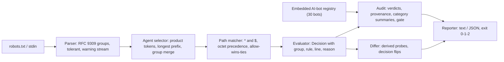

# crawlaw

[English](README.md) | [中文](README.zh.md) | [日本語](README.ja.md)

[](LICENSE)   [](CONTRIBUTING.md)

**开源、零依赖的 robots.txt 评估器，语义与 RFC 9309 完全一致：证明哪些爬虫可以抓取什么，一条命令对照你的策略审计 30 个已知 AI 爬虫，并按行为（而非文本）对比两份策略的差异——完全离线。**


```bash
# not yet on npm — install from a checkout of this repository
npm install && npm run build && npm pack
npm install -g ./crawlaw-0.1.0.tgz
```

## 为什么选 crawlaw？

AI 爬虫封锁是 2026 年出版行业最激烈的战场，而这场仗打在一个几乎没人能正确评估的文件格式里。决定 GPTBot 能否读取你的存档的规则十分微妙：分组选择是对产品令牌做最长前缀匹配，`Googlebot-News` 会默默服从 `googlebot` 分组，同一令牌的多个分组必须合并，优先级按字节数取最长匹配且平局时 allow 获胜，`$` 是锚点，`%2F` 不等于 `/`，空的 `Disallow:` 的含义与它看起来的正好相反。多数"robots 检查器"是托管网页表单，一次只能评一个 URL；解析器库只回答允许/不允许，说不出*为什么*，不知道哪些 user agent 是 AI 训练器、哪些是搜索引擎，也无法告诉你编辑文件后发生了什么变化。crawlaw 是一台自带凭据的规范级评估引擎：每个裁决都引用命中的分组、获胜规则及其行号；内嵌的 30 个 AI 时代爬虫注册表（含有据可查的合规性注记）让一条命令变成完整审计；语义差异器在派生的探测路径上评估策略的两个版本，让评审看到每一个翻转的决定——全部离线、确定性、并为 CI 提供退出码。

|  | crawlaw | robots-parser (npm) | Google robotstxt (C++) | 托管 robots 测试器 |
|---|---|---|---|---|
| 带证据的裁决（分组、规则、行号） | 有——每个决定 | 布尔值 + 行索引 | 布尔值 | 部分，按 URL |
| AI 爬虫审计（内嵌 30 个爬虫注册表） | 有，一条命令 | 无 | 无 | 无 |
| 合规性诚实（无视 robots.txt 的爬虫） | 逐爬虫标注 | 无 | 无 | 无 |
| 语义策略差异（比决定而非文本） | 有，带派生探测 | 无 | 无 | 无 |
| 运行位置 | 你的终端和 CI，完全离线 | JS 库 | C++ 库 + CLI | 别人的服务器 |
| CI 退出码 / 门禁 | 0/1/2 + `--require-blocked` | 库返回值 | 二元退出码 | 无 |
| 运行时依赖 | 0 | 0 | abseil + CMake 工具链 | 不适用（托管） |

<sub>能力说明依据各项目的公开文档核对，2026-07。</sub>

## 功能

- **RFC 9309 精确评估** — 最长前缀分组选择并按 RFC 要求合并分组，`*`/`$` 模式用线性无正则匹配，按字节度量的最长匹配优先级，平局 allow 获胜，百分号编码规范化（`%7E` ≡ `~`，`%2F` ≢ `/`），默认允许。
- **经得起辩护的裁决** — `check` 为每条路径打印命中的分组、获胜规则和两处行号；`--format json` 为机器携带同样的证据。
- **内嵌 30 个 AI 爬虫注册表** — 从 GPTBot 到 Bytespider，按类别（训练 / AI 搜索 / 按需抓取器 / 搜索 / 存档）组织，含运营方、用途和有出处的 `respectsRobots` 字段；`audit` 一条命令全部跑完，离线。
- **对纸糊盾牌保持诚实** — 对有文档记载会无视 robots.txt 的爬虫，"blocked" 裁决会被标注而非庆祝：规则是请求，不是锁。
- **语义策略差异** — `diff` 从两侧的每条规则模式派生探测路径，报告每个翻转的 agent/路径决定及前后原因，外加结构变化；有变化则退出 1，如同 diff(1)。
- **为 CI 而生，零依赖** — 确定性输出，`--require-blocked ai-training` 可作部署门禁，`-` 读 stdin，退出码 0/1/2；唯一要求是 Node.js，且工具从不打开套接字。

## 快速上手

安装：

```bash
# not yet on npm — install from a checkout of this repository
npm install && npm run build && npm pack
npm install -g ./crawlaw-0.1.0.tgz
```

询问某个爬虫能否抓取一个 URL（`examples/publisher.txt` 随仓库附带）：

```bash
crawlaw check examples/publisher.txt --agent GPTBot /articles/2026/scoop
```

输出（真实运行记录）：

```text
BLOCKED  GPTBot  /articles/2026/scoop
          group "gptbot" (line 4), rule "disallow: /" (line 11) is the longest match
```

退出码 1——被封锁，并有行号为证。接着对照所有已知 AI 爬虫审计整份策略（真实运行记录，节选第一个类别）：

```bash
crawlaw audit examples/publisher.txt
```

```text
crawlaw audit — examples/publisher.txt — 30 known bots, path /

AI training — 7 of 15 blocked
  bot                           operator               verdict                          how
  GPTBot                        OpenAI                 blocked                          explicit "gptbot" group (line 4)
  ClaudeBot                     Anthropic              blocked                          explicit "claudebot" group (line 4)
  CCBot                         Common Crawl           blocked                          explicit "ccbot" group (line 4)
  Google-Extended               Google                 blocked                          explicit "google-extended" group (line 4)
  Applebot-Extended             Apple                  blocked                          explicit "applebot-extended" group (line 4)
  Bytespider                    ByteDance              blocked (!) compliance disputed  explicit "bytespider" group (line 4)
  Meta-ExternalAgent            Meta                   blocked                          explicit "meta-externalagent" group (line 4)
  FacebookBot                   Meta                   allowed                          "*" group (line 16)
  ...

note: a robots.txt rule is a request, not a lock —
  Bytespider: Feeds ByteDance LLMs; repeatedly reported crawling despite disallow rules.
  PerplexityBot: Builds the Perplexity answer index; third parties have reported undeclared fetching.
```

这份策略*点名*了七个 AI 训练器，但还有八个仍在自由爬取——这正是 `--require-blocked ai-training` 会变成构建失败的缺口。要按行为而非文本评审一次策略修改（真实运行记录，节选）：

```bash
crawlaw diff examples/before.txt examples/after.txt
```

```text
crawlaw diff — examples/before.txt → examples/after.txt (6 probe paths)

6 decisions changed:
  * (any other bot)  /internal/   blocked → allowed
  * (any other bot)  /internal/x  blocked → allowed
  ccbot              /            allowed → blocked
  ccbot              /x           allowed → blocked
  gptbot             /            allowed → blocked
  gptbot             /x           allowed → blocked

  * /internal/
    before: group "*": disallow: /internal/ (line 4)
    after:  group "*": no rule covers the path (default allow)
  ...
```

这次修改如期封锁了 GPTBot——却意外把 `/internal/` 向其他所有爬虫敞开。更多场景（完整出版方审计、CI 门禁脚本）见 [examples/](examples/README.md)。

## 命令

| 命令 | 作用 | 退出码 |
|---|---|---|
| `check <robots> --agent <bot> <path>...` | 评估一个爬虫对路径/URL 的访问，附证据 | 0 允许，1 封锁，2 用法错误 |
| `audit <robots> [--path <p>]... [--require-blocked <cat>]` | 运行内嵌注册表，类别汇总，CI 门禁 | 0 通过，1 门禁失败，2 用法错误 |
| `diff <old> <new> [--agent <bot>]... [--path <p>]...` | 在派生探测路径上做语义差异 | 0 相同，1 有变化，2 用法错误 |
| `agents [--category <cat>]` | 打印内嵌注册表 | 0，2 用法错误 |

所有子命令都接受 `--format text|json`（JSON 形状是稳定 API）、`--quiet` 静默 stderr 上的解析警告，以及用 `-` 从 stdin 读取 robots.txt。`--agent` 接受裸令牌（`GPTBot`）、`Token/1.2` 形式或完整 User-Agent 头。注册表类别：`ai-training`、`ai-search`、`ai-assistant`、`search`、`archive`——收录标准见 [docs/registry.md](docs/registry.md)，精确匹配语义见 [docs/evaluation.md](docs/evaluation.md)。

## 架构



## 路线图

- [x] RFC 9309 解析器 + 评估器、30 爬虫 AI 注册表、`check`/`audit`/`diff`/`agents`、`--require-blocked` 门禁、JSON 输出（v0.1.0）
- [ ] `crawlaw fix`：输出修正后的策略（点名遗漏的 AI 训练器、恢复丢失的规则）
- [ ] Sitemap 交叉检查：标出同一策略却禁止抓取的 sitemap URL
- [ ] 注册表同步工具：从运营方文档生成 `src/registry.ts` 更新，附引用
- [ ] 多文件审计：把你运营的所有站点的 robots.txt 汇成一份报告

完整列表见 [open issues](https://github.com/JaydenCJ/crawlaw/issues)。

## 参与贡献

欢迎贡献。用 `npm install && npm run build` 构建，然后运行 `npm test`（90 个测试）和 `bash scripts/smoke.sh`（必须打印 `SMOKE OK`）——本仓库不附带 CI，上述所有断言都由本地运行验证。参见 [CONTRIBUTING.md](CONTRIBUTING.md)，认领一个 [good first issue](https://github.com/JaydenCJ/crawlaw/issues?q=is%3Aissue+is%3Aopen+label%3A%22good+first+issue%22)，或发起一个 [discussion](https://github.com/JaydenCJ/crawlaw/discussions)。

## 许可证

[MIT](LICENSE)
